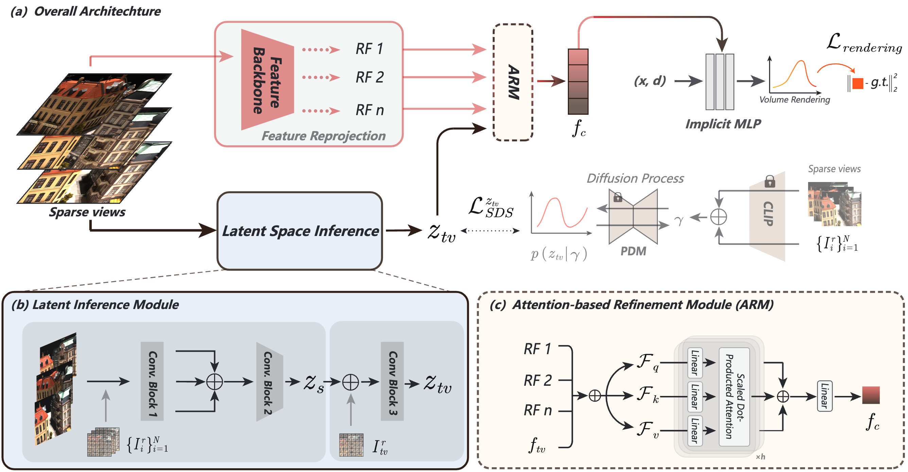

## Official PyTorch implementation of "ID-NeRF: Indirect Diffusion-guided Neural Radiance Fields for Generalizable View Synthesis"

---

### Abstract

Implicit neural representations, represented by Neural Radiance Fields (NeRF), have dominated research in 3D computer vision by virtue of high-quality visual results and data-driven benefits. However, their realistic applications are hindered by the need for dense inputs and per-scene optimization. To solve this problem, previous methods implement generalizable NeRFs by extracting local features from sparse inputs as conditions for the NeRF decoder. However, although this way can allow feed-forward reconstruction, they suffer from the inherent drawback of yielding sub-optimal results caused by erroneous reprojected features. In this paper, we focus on this problem and aim to address it by introducing pre-trained generative priors to enable high-quality generalizable novel view synthesis. Specifically, we propose a novel Indirect Diffusion-guided NeRF framework, termed ID-NeRF, which leverages pre-trained diffusion priors as a guide for the reprojected features created by the previous paradigm. Notably, to enable 3D-consistent predictions, the proposed ID-NeRF discards the way of direct supervision commonly used in prior 3D generative models and instead adopts a novel indirect prior injection strategy. This strategy is implemented by distilling pre-trained knowledge into an imaginative latent space via score-based distillation, and an attention-based refinement module is then proposed to leverage the embedded priors to improve reprojected features extracted from sparse inputs. We conduct extensive experiments on multiple datasets to evaluate our method, and the results demonstrate the effectiveness of our method in synthesizing novel views in a generalizable manner, especially in sparse settings.

<p align="center"></p>

----

### Contents
- [Setup Environment](#setup-environment)
- [Prepare Data](#prepare-data)
  - [DTU dataset](#dtu-dataset)
  - [Real Forward Facing dataset](#real-forward-facing-dataset)
- [Training](#training)
- [Acknowledgments](#acknowledgments)

## Setup Environment

Our project is run on Python 3.10, CUDA 11.8 and Pytorch 2.0.0. To run our project, you need to run the code below first to install the required dependencies.

```bash
git clone --recursive https://github.com/Iron-LYK/idnerf.git
cd idnerf
conda create --name idnerf python=3.10.9
conda activate idnerf
pip install -r requirements.txt
pip install git+https://github.com/openai/CLIP.git
```

## Prepare Data

### DTU dataset

* We use the DTU dataset for training and testing, so befor running, you need to download the preprocessed DTU training data [dtu_training.rar](https://drive.google.com/file/d/1eDjh-_bxKKnEuz5h-HXS7EDJn59clx6V/view) and [Depth_raw.zip](https://virutalbuy-public.oss-cn-hangzhou.aliyuncs.com/share/cascade-stereo/CasMVSNet/dtu_data/dtu_train_hr/Depths_raw.zip) from original [MVSNet repo](https://github.com/YoYo000/MVSNet). And then, extract 'Cameras/' and 'Rectified/' from the downloaded 'dtu_training.rar', and extract 'Depths' from the 'Depth_raw.zip'. Link all three folders to `data/DTU`, which should then have the following structure:

```bash
data/DTU/
    |__ Cameras/
    |__ Depths/
    |__ Rectified/
```

### Real Forward Facing dataset

* We also use the Real Forward Facing dataset for testing, you can download [nerf_llff_data.zip](https://drive.google.com/drive/folders/128yBriW1IG_3NJ5Rp7APSTZsJqdJdfc1) and extract to `data/nerf_llff_data`.

## Training
Using the following code to train our model
```bash
python train.py --yaml=train
```
Before run it, you need to download the GMFlow pretrained weight ([gmflow_sintel-0c07dcb3.pth](https://drive.google.com/file/d/1d5C5cgHIxWGsFR1vYs5XrQbbUiZl9TX2/view)) from  the original [GMFlow repo](https://github.com/haofeixu/gmflow), and save it to `configs/pretrained_models/gmflow_sintel-0c07dcb3.pth`.


## Acknowledgments

We are very grateful for the great work of [GMFlow](https://github.com/haofeixu/gmflow), [MatchNeRF](https://github.com/donydchen/matchnerf), [Latent-NeRF](https://github.com/eladrich/latent-nerf), and [SparseFusion](https://github.com/zhizdev/sparsefusion),  as their code has greatly helped our implementation.
